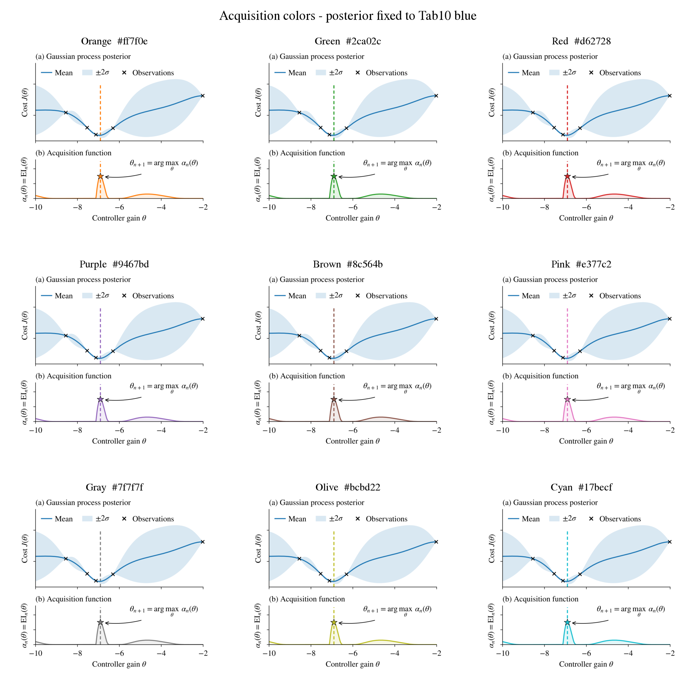

# Acquisition color variants

All variants preserve version 9: 219 x 200 TeX pt, 9 pt main text,
2:1 panel heights, black axes, and a blue Gaussian process posterior.
The acquisition curve, shading, star, and dashed guides share the selected Tab10 color.



| Color | Hex | White PDF | Transparent PDF |
|---|---|---|---|
| Orange | #ff7f0e | [White](non_transparent/bo_acquisition_orange_white.pdf) | [Transparent](transparent/bo_acquisition_orange_transparent.pdf) |
| Green | #2ca02c | [White](non_transparent/bo_acquisition_green_white.pdf) | [Transparent](transparent/bo_acquisition_green_transparent.pdf) |
| Red | #d62728 | [White](non_transparent/bo_acquisition_red_white.pdf) | [Transparent](transparent/bo_acquisition_red_transparent.pdf) |
| Purple | #9467bd | [White](non_transparent/bo_acquisition_purple_white.pdf) | [Transparent](transparent/bo_acquisition_purple_transparent.pdf) |
| Brown | #8c564b | [White](non_transparent/bo_acquisition_brown_white.pdf) | [Transparent](transparent/bo_acquisition_brown_transparent.pdf) |
| Pink | #e377c2 | [White](non_transparent/bo_acquisition_pink_white.pdf) | [Transparent](transparent/bo_acquisition_pink_transparent.pdf) |
| Gray | #7f7f7f | [White](non_transparent/bo_acquisition_gray_white.pdf) | [Transparent](transparent/bo_acquisition_gray_transparent.pdf) |
| Olive | #bcbd22 | [White](non_transparent/bo_acquisition_olive_white.pdf) | [Transparent](transparent/bo_acquisition_olive_transparent.pdf) |
| Cyan | #17becf | [White](non_transparent/bo_acquisition_cyan_white.pdf) | [Transparent](transparent/bo_acquisition_cyan_transparent.pdf) |

Regenerate from the repository root:

```sh
.venv/bin/python plots/bo_acquisition_colors.py
```

Uses the cached snapshot; earlier versions are untouched. All files remain local and Git-ignored.
